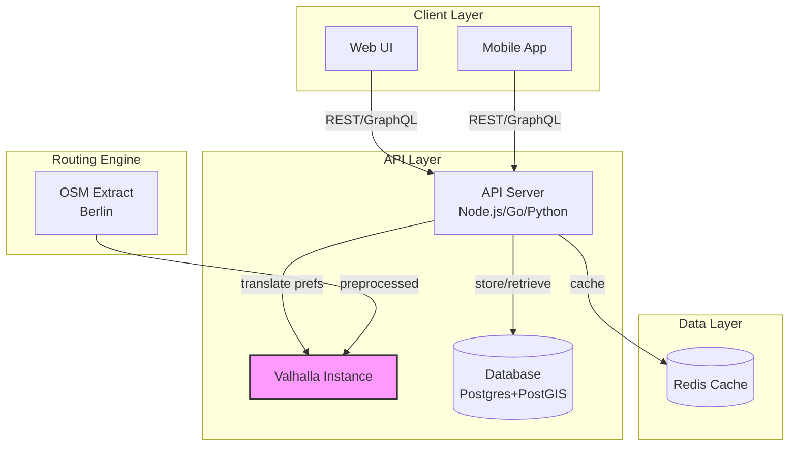
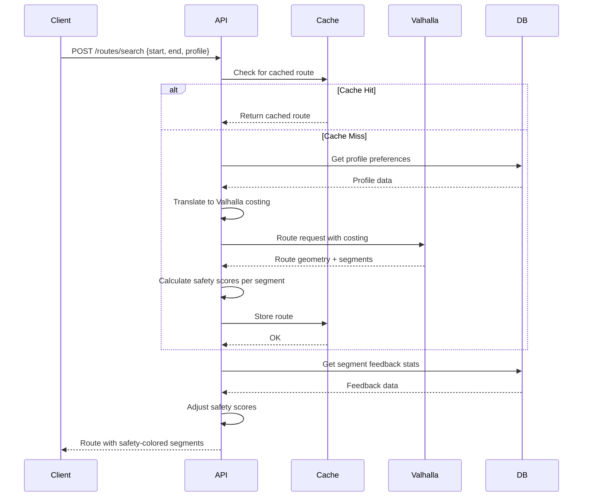

# Technical Architecture Proposal

## Architecture Overview



## Component Details

### 1. Routing Engine: Valhalla

**Why Valhalla:**
- Dynamic costing allows preference adjustments without graph rebuild
- Comprehensive bike-specific features
- Production-ready and battle-tested
- Flexible enough to implement our safety preference model

**Setup:**
- Self-hosted Valhalla instance
- Berlin OSM extract from Geofabrik
- Pre-process into Valhalla tile format
- Update monthly (or as needed)

**Costing Profiles:**

```json
{
  "family_with_trailer": {
    "bicycle_type": "hybrid",
    "use_roads": 0.2,
    "cycling_speed": 12,
    "avoid_bad_surfaces": 0.9,
    "use_hills": 0.3
  },
  "confident_solo": {
    "bicycle_type": "road",
    "use_roads": 0.6,
    "cycling_speed": 20,
    "avoid_bad_surfaces": 0.5,
    "use_hills": 0.7
  }
}
```

### 2. API Server

**Responsibilities:**
- Accept routing requests with user preferences
- Translate preferences to Valhalla costing parameters
- Store user profiles, saved routes, feedback
- Serve route alternatives
- Handle route tweaking (avoid segments, prefer segments)
- Aggregate feedback for route quality scoring

**Technology Options:**
- **Option A (Recommended)**: Go + Chi/Gin
  - Fast, efficient, good concurrency
  - Easy deployment (single binary)
  - Good Valhalla client libraries
- **Option B**: Node.js + Express
  - Fast iteration, familiar ecosystem
  - Good for MVP
- **Option C**: Python + FastAPI
  - If team prefers Python
  - Easy integration with GIS libraries

**Key Endpoints:**
```
POST /routes/search
  - Input: start, end, profile, preferences
  - Output: Route(s) with segments and safety scores

GET /routes/:id
  - Retrieve saved route

POST /routes/:id/feedback
  - Submit feedback on route segment

PUT /routes/:id/tweak
  - Adjust route (avoid/prefer segments)

GET /profiles
  - List available rider profiles

POST /profiles
  - Create custom profile
```

### 3. Database: Postgres + PostGIS

**Schema (simplified):**

```sql
-- User profiles
CREATE TABLE rider_profiles (
  id UUID PRIMARY KEY,
  user_id UUID,
  name VARCHAR(255),
  preferences JSONB,  -- safety weights, speeds, etc.
  created_at TIMESTAMP
);

-- Saved routes
CREATE TABLE routes (
  id UUID PRIMARY KEY,
  user_id UUID,
  profile_id UUID,
  start_point GEOGRAPHY(POINT),
  end_point GEOGRAPHY(POINT),
  geometry GEOGRAPHY(LINESTRING),
  metadata JSONB,  -- distance, estimated time, safety score
  created_at TIMESTAMP
);

-- Segment feedback
CREATE TABLE segment_feedback (
  id UUID PRIMARY KEY,
  route_id UUID,
  segment_geom GEOGRAPHY(LINESTRING),
  rating INTEGER,  -- 1-5
  tags TEXT[],  -- ["too_busy", "great_surface", "narrow", etc.]
  comment TEXT,
  created_at TIMESTAMP
);

-- Route tweaks
CREATE TABLE route_tweaks (
  id UUID PRIMARY KEY,
  route_id UUID,
  tweak_type VARCHAR(50),  -- 'avoid' or 'prefer'
  segment_geom GEOGRAPHY(LINESTRING),
  created_at TIMESTAMP
);
```

### 4. Client Layer

**MVP: Web UI**
- Interactive map (Mapbox GL JS or MapLibre)
- Start/end point selection
- Profile selector
- Route preview with segment safety color-coding
- Segment feedback UI

**Phase 2: Mobile App**
- React Native or Flutter
- Turn-by-turn navigation
- Offline route caching
- Watch integration (optional)

### 5. Caching Layer: Redis

**Cache Strategy:**
- Cache common routes (30 day TTL)
- Cache OSM-derived data (Fahrradstrasse locations, etc.)
- Cache user profile lookups
- Invalidate on feedback that significantly changes segment quality

## Data Flow: Route Request



## Preference → Valhalla Costing Translation

**OSM Tag Mapping:**

| Feature | OSM Tags | Valhalla Costing Adjustment |
|---------|----------|---------------------------|
| Fahrradstrasse | `bicycle_road=yes` | `use_roads=0.1`, very low cost |
| Separated path | `cycleway=track` | Low cost multiplier (0.2x) |
| Painted lane | `cycleway=lane` | Medium-low cost (0.5x) |
| Quiet residential | `highway=residential` + low `maxspeed` | Time-aware: 0.7x during off-peak |
| Bus lane | `cycleway=share_busway` | Medium cost (0.8x for solo, 1.5x for family) |
| Busy road | `highway=primary/secondary` + no bike infra | High cost (2-5x) |

**User Preference Sliders:**
- Safety priority (0-100): Maps to `use_roads` inversion
- Hill tolerance (0-100): Maps to `use_hills`
- Surface quality importance (0-100): Maps to `avoid_bad_surfaces`
- Speed preference: Maps to `cycling_speed`

## Deployment Architecture

**MVP (Single Region):**
```
┌─────────────────┐
│   CloudFlare    │  CDN + DDoS protection
└────────┬────────┘
         │
┌────────▼────────┐
│  Load Balancer  │  (nginx or cloud LB)
└────────┬────────┘
         │
    ┌────┴────┐
    │         │
┌───▼──┐  ┌──▼───┐
│ API  │  │ API  │   (2+ instances)
└───┬──┘  └──┬───┘
    └────┬────┘
         │
    ┌────┴────┐
    │         │
┌───▼────┐ ┌─▼──────┐ ┌─▼─────────┐
│Valhalla│ │Postgres│ │   Redis   │
└────────┘ └────────┘ └───────────┘
```

**Hosting Options:**
- **Option A**: Self-hosted VPS (Hetzner, DigitalOcean)
  - Lower cost, full control
  - Valhalla needs ~4GB RAM for Berlin
- **Option B**: Cloud (AWS/GCP/Azure)
  - Easier scaling, managed services
  - Higher cost

## Technology Stack Summary

| Layer | Technology | Rationale |
|-------|-----------|-----------|
| Routing Engine | Valhalla | Flexible bike routing, dynamic costing |
| API Server | Go + Chi/Gin | Fast, efficient, easy deployment |
| Database | Postgres + PostGIS | Best GIS support, mature |
| Cache | Redis | Fast, simple, reliable |
| Web Frontend | React + MapLibre | Modern, good map support |
| Mobile (Phase 2) | React Native | Code sharing with web |
| Hosting | Hetzner VPS | Cost-effective for MVP |

## Development Phases

### Phase 0: Research & Validation (Current)
- ✅ Document vision and requirements
- ✅ Research routing engines
- ✅ Propose architecture
- ⏳ Validate Valhalla with Berlin data (build proof-of-concept)

### Phase 1: MVP (Core Routing)
- Set up Valhalla with Berlin OSM extract
- Build API with basic routing endpoints
- Create web UI with map and route preview
- Implement 2-3 rider profiles
- Deploy to staging

### Phase 2: Feedback & Refinement
- Add segment feedback system
- Implement route tweaking (avoid/prefer)
- Aggregate feedback to improve routing
- Add route saving and sharing

### Phase 3: Mobile & Advanced
- Mobile app with turn-by-turn
- Offline route support
- Watch integration
- Community route collections

## Open Questions

1. **Hosting location**: Self-hosted VPS vs cloud?
2. **Authentication**: Do we need user accounts for MVP, or can we start anonymous?
3. **Data updates**: How often should we refresh OSM data? (Monthly? Weekly?)
4. **Feedback moderation**: How to handle spam/malicious feedback?
5. **Business model**: Free/open-source? Donation-supported? Freemium?

## Next Steps

1. Build Valhalla proof-of-concept with Berlin data
2. Test costing profiles with known routes
3. Validate that preference model maps correctly to Valhalla parameters
4. Make go/no-go decision on Valhalla vs alternatives
5. If go: proceed with API server development
