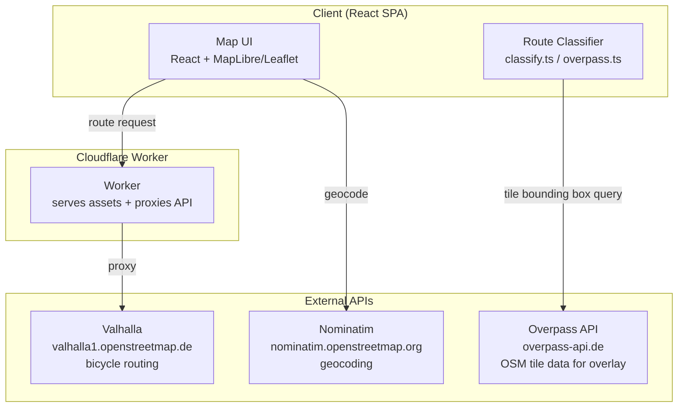
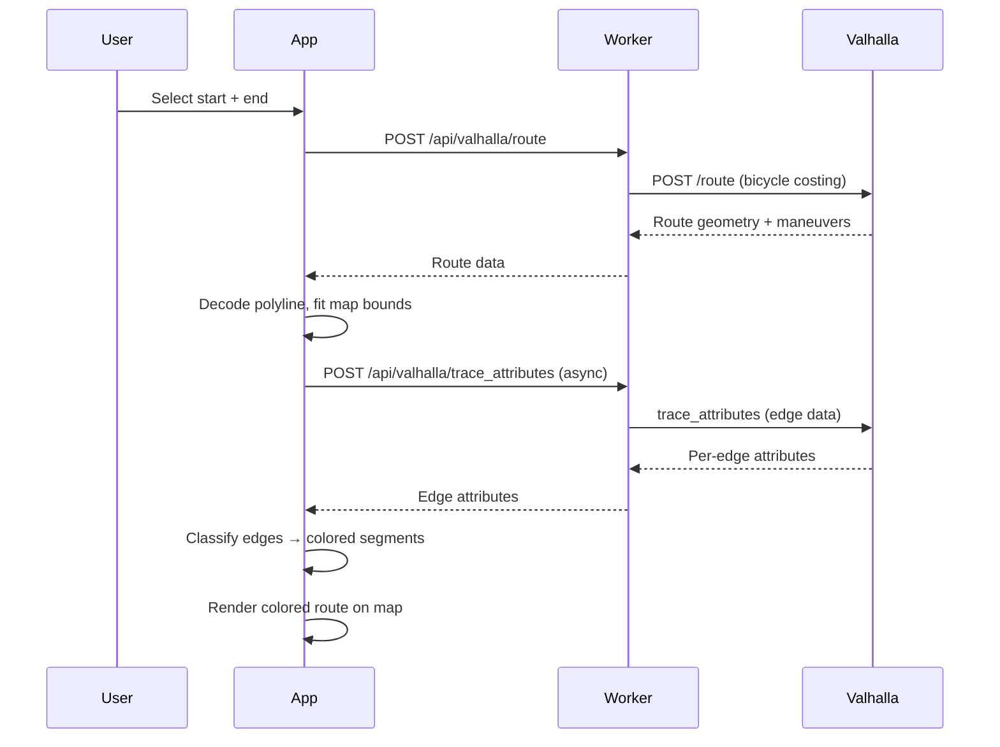

# Technical Architecture

## Current Architecture (Implemented)

The app is a single-page web application deployed on Cloudflare Workers. There is no separate backend — the Worker serves both static assets and proxies API calls.

## Component Details

### Frontend (React + Leaflet)

**Key files:**

| File | Purpose |
|------|---------|
| `src/App.tsx` | App state, route computation, profile management |
| `src/components/Map.tsx` | Leaflet map, route polyline display, auto-fit bounds |
| `src/components/ProfileEditor.tsx` | Edit rider profiles, avoidances, costing sliders |
| `src/components/ProfileSelector.tsx` | Profile switcher (on-map overlay) |
| `src/components/BikeMapOverlay.tsx` | Tile-cached bike infrastructure overlay from Overpass |
| `src/components/Legend.tsx` | Route quality legend with safety class toggles |
| `src/components/SearchBar.tsx` | Address autocomplete via Nominatim |
| `src/components/DirectionsPanel.tsx` | Turn-by-turn directions and route summary |
| `src/services/routing.ts` | Valhalla route requests, profile definitions |
| `src/services/overpass.ts` | OSM bike infrastructure queries and classification |
| `src/services/geocoding.ts` | Nominatim forward/reverse geocoding |
| `src/utils/classify.ts` | Edge → SafetyClass classification (profile-aware) |
| `src/utils/types.ts` | Shared types including `SafetyClass`, `RiderProfile` |
| `src/hooks/useGeolocation.ts` | GPS watch position hook |

### Routing: Valhalla (Public Instance)

All routing calls go through the Cloudflare Worker which proxies to `valhalla1.openstreetmap.de`. The Worker handles CORS and rate limiting.

**Costing profiles** (defined in `routing.ts`):

| Profile | Bicycle Type | Speed | Use Roads | Avoid Bad Surfaces |
|---------|-------------|-------|-----------|-------------------|
| toddler | Hybrid | 10 km/h | 0.0 | 0.5 |
| trailer | Hybrid | 11 km/h | 0.15 | 0.5 |
| training | Road | 22 km/h | 0.6 | 0.4 |

When a profile has `avoidances: ['cobblestones']`, the routing enforces `avoid_bad_surfaces >= 0.5` in the Valhalla request.

**Two-phase route rendering:**
1. `getRoute()` — fast Valhalla `/route` call, returns geometry + maneuvers
2. `getRouteSegments()` — async Valhalla `trace_attributes` call, classifies each edge and colors segments by safety class

### Safety Classification Model

Routes are displayed using a 4-level safety model (`SafetyClass`):

| Level | Constant | Color | Meaning |
|-------|----------|-------|---------|
| `great` | `SAFETY_CLASS.GREAT` | Green | Car-free path / Fahrradstrasse |
| `good` | `SAFETY_CLASS.GOOD` | Green | Shared footway / pedestrian path |
| `ok` | `SAFETY_CLASS.OK` | Amber | Separated track / living street |
| `bad` | `SAFETY_CLASS.BAD` | Red | Road without protection |

Classification is **profile-aware** — the same road can be 'ok' for a trailer but 'bad' for a toddler. See `classify.ts` and `overpass.ts` for the full logic.

Use `SAFETY_CLASS` constants (from `types.ts`) instead of raw string literals.

### Bike Infrastructure Overlay

`BikeMapOverlay` fetches OSM data via Overpass API at the current map viewport. Results are cached by tile (256px grid), so panning/zooming reuses already-fetched data. Rendering is throttled by zoom level — the overlay only activates at zoom ≥ 14.

### Deployment

**Cloudflare Workers** serves everything:
- Static assets (React SPA, built by Vite)
- API proxy endpoints at `/api/valhalla/*`
- Feedback endpoint at `/api/feedback`

No database, no cache layer — all state lives in the browser (localStorage for profiles, in-memory for route/overlay data).

## Data Flow: Route Request

## Rider Profiles

Profiles are defined in `routing.ts` as `DEFAULT_PROFILES`. Users can customise any profile (stored in `localStorage`). Each profile has:

- `costingOptions` — Valhalla bicycle costing parameters
- `avoidances` — named avoidance categories (e.g. `['cobblestones']`) that override costing options
- `editable` — whether the user can modify this profile

## Open Questions / Future Work

1. **Multi-city support**: Currently Berlin-only via the public Valhalla instance. Long-term: self-hosted with configurable OSM extracts.
2. **User accounts**: No auth yet — profiles stored in localStorage only.
3. **Route saving/sharing**: Not implemented.
4. **Feedback system**: `FeedbackWidget` exists but feeds a simple endpoint; no aggregation or crowdsourced routing yet.
5. **Mobile app**: Web-only for now.
