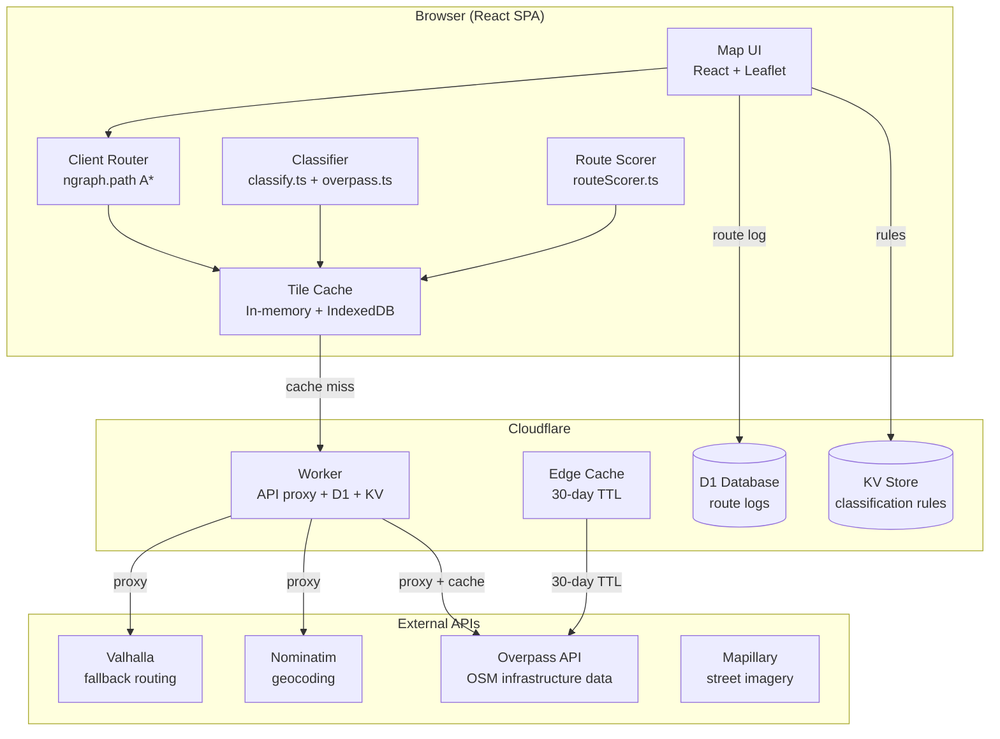
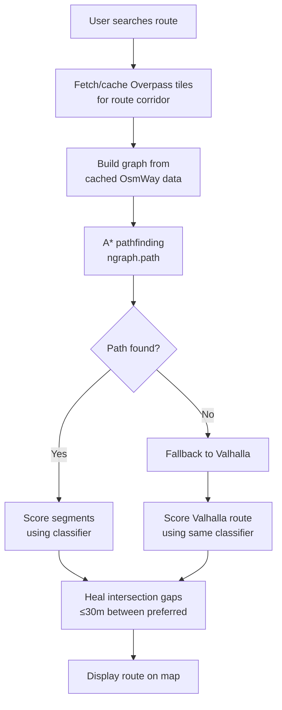
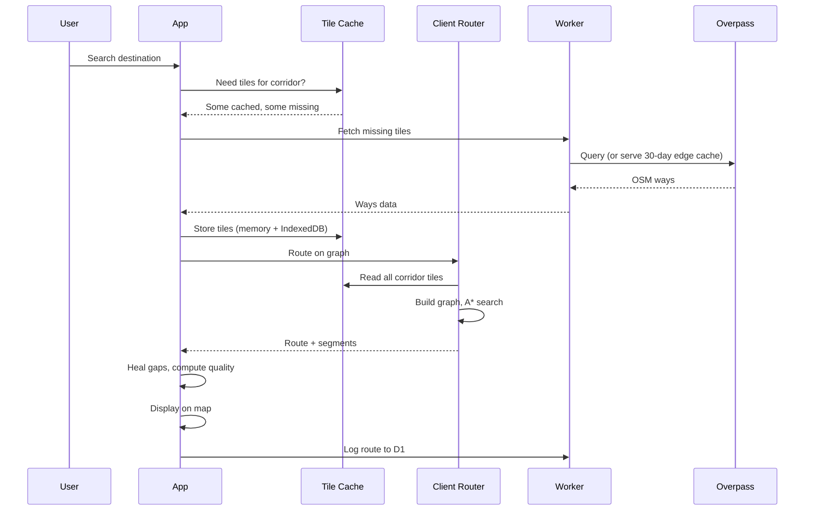
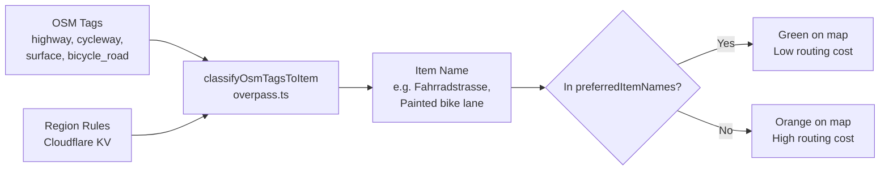

# Technical Architecture

## System Overview

## Routing Architecture

### Cost Model (speed-based)

The client router uses **time as cost** — faster segments are cheaper. This naturally handles multimodal routing: walking is slow, biking preferred paths is fast.

| Infrastructure (toddler) | Speed | Cost per 100m |
|---|:---:|:---:|
| Fahrradstrasse | 12 km/h | 30s |
| Bike path (Radweg) | 10 km/h | 36s |
| Elevated sidewalk path | 9 km/h | 40s |
| Shared foot path / Living street | 8 km/h | 45s |
| Residential/local road | 4 km/h | 90s |
| Painted bike lane | 3 km/h | 120s |
| Walking (footway) | 5 km/h | 72s |
| Unclassified road without sidewalk | **Excluded** | ∞ |

### Gap Healing

OSM has short unclassified segments at intersections (crossings, turning circles). If a non-preferred segment is ≤5 coordinates (~30m) with preferred segments on both sides, it inherits the surrounding classification. Applied to route display, quality metrics, and client router output.

## Data Flow

## Classification System

Single source of truth for all infrastructure classification. Used by: map overlay, route coloring, route scoring, client router cost function.

### Per-travel-mode infrastructure preferences

| Infrastructure | Toddler | Trailer | Training |
|---|:---:|:---:|:---:|
| Bike path | Preferred | Preferred | Preferred |
| Fahrradstrasse | Preferred | Preferred | Preferred |
| Shared foot path | Preferred | Preferred | Preferred |
| Elevated sidewalk path | Preferred | Other | Other |
| Living street | Preferred | Preferred | Preferred |
| Painted bike lane | Other | Preferred | Preferred |
| Shared bus lane | Other | Preferred | Preferred |
| Residential/local road | Other | Preferred | Preferred |
| Rough surface | Other | Other | Other |

### Surface handling (per-mode)

| Surface | Toddler | Trailer | Training |
|---|:---:|:---:|:---:|
| paving_stones | OK | Rough | Rough |
| compacted | OK | OK | OK |
| sett/cobblestone | Rough | Rough | Rough |
| dirt/gravel/sand | Rough | Rough | Rough |

## Key Files

| File | Purpose |
|------|---------|
| `src/services/clientRouter.ts` | Client-side A* routing on Overpass graph |
| `src/services/routeScorer.ts` | Score any route using Overpass data |
| `src/services/overpass.ts` | Overpass queries, tile cache, `classifyOsmTagsToItem` |
| `src/utils/classify.ts` | PROFILE_LEGEND, quality metrics, gap healing |
| `src/services/routing.ts` | Valhalla API (fallback), profile definitions |
| `src/services/tileCache.ts` | IndexedDB tile persistence, city detection |
| `src/services/brouter.ts` | BRouter API (comparison routing) |
| `src/services/rules.ts` | Per-region classification rules (KV) |
| `src/services/audit.ts` | City scan, tag grouping, classification audit |
| `src/services/routeLog.ts` | Route logging to D1 |
| `src/services/mapillary.ts` | Mapillary street-level imagery |
| `src/components/Map.tsx` | Leaflet map, route display, segment suggestions |
| `src/components/BikeMapOverlay.tsx` | Canvas-rendered bike infrastructure overlay |
| `src/components/DirectionsPanel.tsx` | Navigation, GPS tracking, speech |
| `src/components/AuditPanel.tsx` | Admin classification audit tool |
| `src/worker.ts` | Cloudflare Worker (all API endpoints) |
| `scripts/benchmark-routing.ts` | Routing quality benchmark (22 Berlin test routes) |

## Infrastructure

| Service | Purpose | Cost |
|---------|---------|------|
| Cloudflare Pages + Workers | SPA hosting + API proxy | Free tier |
| Cloudflare KV | Classification rules per region | Free tier |
| Cloudflare D1 | Route logs, segment feedback | Free tier |
| Cloudflare Edge Cache | 30-day Overpass tile cache | Free |
| Sentry | Error tracking | Free tier |
| Mapillary | Street-level imagery in audit tool | Free API |
| Valhalla (public) | Fallback routing | Free |
| BRouter (public) | Comparison routing | Free |
| Overpass (public) | OSM infrastructure data | Free |

## Benchmark Results (2026-04-11)

22 Berlin test routes, toddler mode:

| Engine | Avg preferred % | Notes |
|--------|:---:|------|
| **Client router** | **57%** | Uses Overpass data + speed-based costing |
| BRouter (safety) | 40% | Generic safety profile, can't express our preferences |
| Valhalla | 35% | `use_roads=0.0` but treats painted lanes as bike infra |

**Note:** The benchmark scores Valhalla/BRouter routes using coordinate-matching against Overpass data (different from the app's segment-based scoring with gap healing). The app's displayed % may differ slightly from benchmark numbers.

## Architecture Rules

1. **Single classification source:** `classifyOsmTagsToItem` in overpass.ts is THE classifier. Used by overlay, router, scorer. Never duplicate.
2. **Never push to main.** Always branch → PR → CI → merge.
3. **Tile cache is the routing graph.** What you see on the map overlay IS what the router routes on.
4. **Speed IS the penalty.** No arbitrary multipliers. Walking is slow → high cost → router finds detours.
5. **Heal intersection gaps.** Short non-preferred gaps between preferred segments are healed everywhere.
6. **City-agnostic.** All tile fetching, caching, and routing work for any city, not just Berlin.
