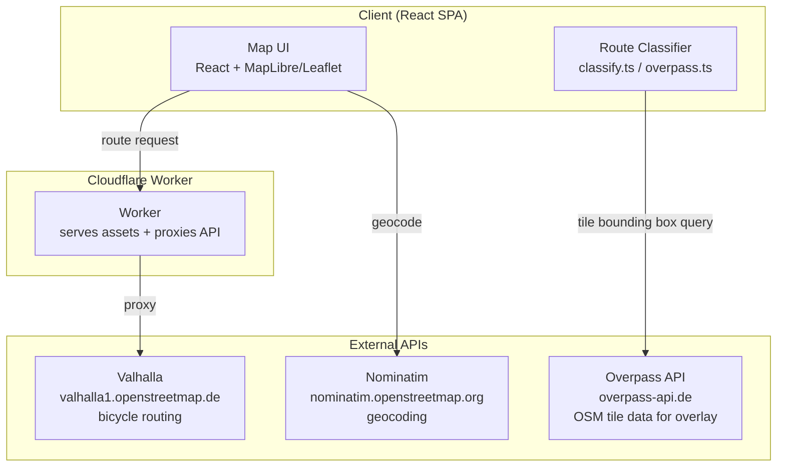
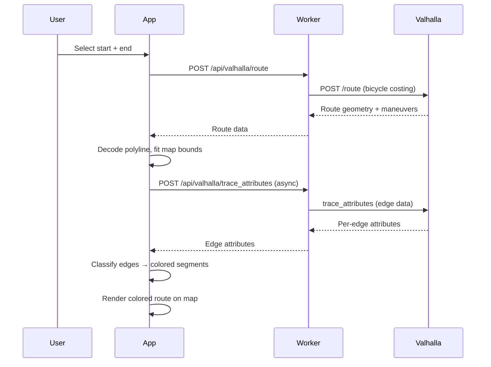

# Technical Architecture

## Current Architecture (Implemented)

The app is a single-page web application deployed on Cloudflare Workers. There is no separate backend — the Worker serves both static assets and proxies API calls.

## Component Details

### Frontend (React + Leaflet)

**Key files:**

| File | Purpose |
|------|---------|
| `src/App.tsx` | App state, route computation, profile management |
| `src/components/Map.tsx` | Leaflet map, route polyline display, auto-fit bounds |
| `src/components/ProfileEditor.tsx` | Edit rider profiles, avoidances, costing sliders |
| `src/components/ProfileSelector.tsx` | Profile switcher (on-map overlay) |
| `src/components/BikeMapOverlay.tsx` | Tile-cached bike infrastructure overlay from Overpass |
| `src/components/Legend.tsx` | Route quality legend with safety class toggles |
| `src/components/SearchBar.tsx` | Address autocomplete via Nominatim |
| `src/components/DirectionsPanel.tsx` | Turn-by-turn directions and route summary |
| `src/services/routing.ts` | Valhalla route requests, profile definitions |
| `src/services/overpass.ts` | OSM bike infrastructure queries and classification |
| `src/services/geocoding.ts` | Nominatim forward/reverse geocoding |
| `src/utils/classify.ts` | Edge → SafetyClass classification (profile-aware) |
| `src/utils/types.ts` | Shared types including `SafetyClass`, `RiderProfile` |
| `src/hooks/useGeolocation.ts` | GPS watch position hook |

### Routing: Valhalla (Public Instance)

All routing calls go through the Cloudflare Worker which proxies to `valhalla1.openstreetmap.de`. The Worker handles CORS and rate limiting.

**Costing profiles** (defined in `routing.ts`):

| Profile | Bicycle Type | Speed | Use Roads | Avoid Bad Surfaces |
|---------|-------------|-------|-----------|-------------------|
| toddler | Hybrid | 10 km/h | 0.0 | 0.5 |
| trailer | Hybrid | 11 km/h | 0.15 | 0.5 |
| training | Road | 22 km/h | 0.6 | 0.4 |

When a profile has `avoidances: ['cobblestones']`, the routing enforces `avoid_bad_surfaces >= 0.5` in the Valhalla request.

**Two-phase route rendering:**
1. `getRoute()` — fast Valhalla `/route` call, returns geometry + maneuvers
2. `getRouteSegments()` — async Valhalla `trace_attributes` call, classifies each edge and colors segments by safety class

### Safety Classification Model

Routes and overlay paths are classified into 3 levels (`SafetyClass`, a string union type matching the display color palette):

| Level | Color | Meaning |
|-------|-------|---------|
| `'green'` | Green (#10b981) | Car-free paths, Fahrradstrasse, shared footways |
| `'amber'` | Amber (#f97316) | Separated tracks alongside roads, living streets |
| `'red'` | Red (#e11d48) | Painted lanes, shared roads, roads without protection |

Classification is **profile-aware** — the same road can be `'amber'` for toddler but `'red'` for trailer. See `classify.ts` and `overpass.ts` for the full logic.

#### Two classification paths (must stay in sync)

| Path | Function | Input | Used by |
|------|----------|-------|---------|
| Routing | `classifyEdge()` in `classify.ts` | Valhalla `trace_attributes` edge | Route segment coloring |
| Overlay | `classifyOsmTags()` in `overpass.ts` | Raw OSM tags from Overpass | Map background overlay |

Both implement the same semantic model. `BAD_SURFACES` (cobblestone, sett, gravel, etc.) is defined once in `classify.ts` and imported by `overpass.ts`. **Any change to classification logic must be applied in both files and verified to produce consistent results.**

Notable Valhalla limitation: it does not expose `cycleway:separation` or `cycleway:buffer` tags, so it cannot distinguish plain painted lanes from bollard-protected ones. The overlay (`overpass.ts`) handles this via `hasSeparation()` and upgrades the classification accordingly.

#### Preferred path types

`PROFILE_LEGEND` in `classify.ts` defines the per-profile list of path types, their `SafetyClass`, and whether they are preferred by default (`defaultPreferred: boolean`). This is the canonical mapping from infrastructure type → legend item → `SafetyClass`.

- `getDefaultPreferredItems(profileKey)` — returns the default preferred item names for a profile
- `getPreferredSafetyClasses(preferredNames, profileKey)` — maps preferred names → `Set<SafetyClass>`

Preferred safety classes are used to:
1. **Color route segments**: preferred → green (`PREFERRED_COLOR`), other → orange (`OTHER_COLOR`)
2. **Filter overlay visibility**: preferred classes shown, others hidden (unless "show all" toggled)
3. **Route quality bar**: fraction of route in preferred vs. non-preferred classes

Preferred types currently affect display only. Routing costing is controlled separately by each profile's `costingOptions` in `routing.ts` and does not change when the user rearranges the legend.

### Bike Infrastructure Overlay

`BikeMapOverlay` fetches OSM data via Overpass API at the current map viewport. Results are cached by tile (0.1° grid, ~74 km² at Berlin latitude), so panning/zooming reuses already-fetched tiles. The overlay shows at all zoom levels but warns when more than 12 tiles would need loading (too zoomed out).

Each overlay way is colored by its `SafetyClass` (from `SAFETY` palette in `classify.ts`). Visibility filtering uses `preferredSafetyClasses` directly — preferred classes are shown, others hidden unless "Show other paths" is toggled.

### Deployment

**Cloudflare Workers** serves everything:
- Static assets (React SPA, built by Vite)
- API proxy endpoints at `/api/valhalla/*`
- Feedback endpoint at `/api/feedback`

No database, no cache layer — all state lives in the browser (localStorage for profiles, in-memory for route/overlay data).

## Data Flow: Route Request

## Rider Profiles

Profiles are defined in `routing.ts` as `DEFAULT_PROFILES`. Users can customise any profile (stored in `localStorage`). Each profile has:

- `costingOptions` — Valhalla bicycle costing parameters
- `avoidances` — named avoidance categories (e.g. `['cobblestones']`) that override costing options
- `editable` — whether the user can modify this profile

## Architecture Rules

### Consistency invariants (checked before every merge)

The following must always be consistent. Before declaring any feature or bug fix done, verify all of them:

1. **Classification parity**: `classifyEdge()` (classify.ts) and `classifyOsmTags()` (overpass.ts) must produce the same `SafetyClass` for equivalent infrastructure. Check both when touching either. The Valhalla-vs-OSM attribute mapping is documented in the comment block above `classifyEdge()`.

2. **PROFILE_LEGEND ↔ classifier alignment**: Every `safetyClass` value in `PROFILE_LEGEND` must match what `classifyEdge()` and `classifyOsmTags()` actually return for that infrastructure type on that profile. If you add a new path type or change a classifier return value, update both.

3. **BAD_SURFACES single source**: `BAD_SURFACES` is defined in `classify.ts` and imported by `overpass.ts`. Never duplicate or redefine it. Changes propagate automatically.

4. **SafetyClass values**: The only valid `SafetyClass` values are `'green'`, `'amber'`, and `'red'`. No legacy names (`great`, `good`, `ok`, `bad`, `avoid`) anywhere in code, tests, or comments that describe runtime behavior.

5. **Color palette single source**: All colors come from `STATUS_COLOR` in `classify.ts`. Never hardcode hex values for route/overlay colors in components.

### URL State Encoding
**All map layout state must be encoded in the URL.** This includes:
- Active profile/mode (`mode=`)
- Custom preferred item set (`preferred=`)
- Visibility toggles (e.g. `showOther=1`)

This ensures the map view is shareable and bookmarkable. State that belongs in the URL: anything that changes what the user sees on the map or how the route is rendered. State that does NOT belong: ephemeral UI (loading spinners, hover states), or profile definitions (stored in localStorage).

## Open Questions / Future Work

1. **Multi-city support**: Currently Berlin-only via the public Valhalla instance. Long-term: self-hosted with configurable OSM extracts.
2. **User accounts**: No auth yet — profiles stored in localStorage only.
3. **Route saving/sharing**: Not implemented.
4. **Feedback system**: `FeedbackWidget` exists but feeds a simple endpoint; no aggregation or crowdsourced routing yet.
5. **Mobile app**: Web-only for now.
