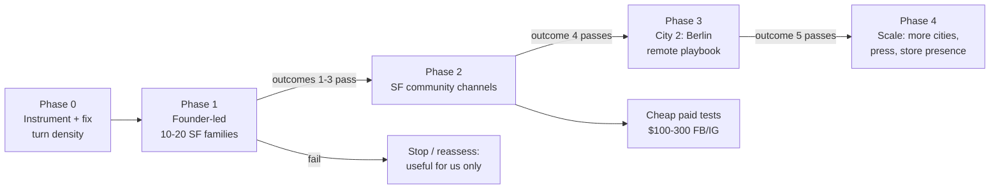

# Launch Strategy — validate usefulness, then grow one city at a time

**Status:** Draft for Bryan's review
**Scope:** Go-to-market, not engineering (engineering readiness items are called out as gates where they block a phase).

## The question this plan answers

Is family-bike-map useful to anyone beyond our own family — and if yes, what's the cheapest, most honest path to making it widely useful, one city at a time?

## What we know going in

- **Product state:** Live at bike-map.fryanpan.com since 2026-04-28 (blog-post launch). 5 ride modes, mobile-first PWA, no accounts. Berlin + SF have calibrated profiles and benchmark coverage (22/22 and 17/17 routes). 14 city research profiles exist beyond that.
- **Instruments that already exist:** every computed route logs to D1 (`/api/route-log`); Userback widget for in-app feedback; Sentry. No general web analytics yet — we can't currently answer "how many distinct people used this last week?"
- **The one piece of real user feedback we have** (Joanna, 2026-04-20): the route quality was good but **turn density made routes hard to follow** without voice nav. She abandoned the suggested route for her own. This is the single biggest threat to word-of-mouth: in tight parent communities, one "I tried it, the route was unfollowable" kills ten referrals.
- **Infrastructure constraint:** Overpass public API rate-limits hard (we hit it repeatedly this week). An uncached city under sudden load = timeouts and blank maps. Any city we promote must be tile-pre-warmed first.

## Measurable outcomes (what "useful" means)

Concrete yes/no statements, evaluated per phase:

1. **Activation:** ≥ 50% of first-time visitors who land on the map compute at least one route. (Proves the UX communicates what it is.)
2. **The core validation metric — return riding:** ≥ 20% of people who compute a route in week N compute another in weeks N+1..N+4. Parents don't bike once; if they don't come back, it wasn't useful.
3. **Route followability:** in qualitative follow-ups, ≥ 7 of 10 riders say they followed the suggested route without bailing to their own. (Directly tests the Joanna failure mode.)
4. **Unprompted spread:** ≥ 5 users we did not personally recruit, attributable to word of mouth (asked at feedback time: "how did you find this?").
5. **City replication:** the city-2 playbook reaches outcomes 1–3 with < 1 week of founder time (proves the model scales beyond founder-presence).

If 1–3 fail after a genuine Phase-1 effort, the honest conclusion is "useful for us, not (yet) for others" — and the plan stops cheap.

## Which city first

**SF first, Berlin second.** Rationale:

- **Founder presence beats data maturity for validation.** You're in SF, ride these routes weekly, and can do in-person recruiting, ride-alongs, and 10-minute feedback chats. Validation is qualitative; you can't do it remotely as well.
- SF has an unusually strong fit between the product and an organized community: **Slow Streets** (the product explicitly models them), **bike buses** (SFUSD school bike-bus crews are literally "parents who need kid-safe routes"), SF Bicycle Coalition's family program, Kid Safe SF.
- Berlin is the strongest city-2: most mature data, biggest Kidical Mass movement in the world (ADFC, Changing Cities), and your lived credibility — but you're not physically there, so it tests the *remote* playbook, which is exactly what city-2 should test.

## Phases

### Phase 0 — Make the experiment measurable and the product referable (gate for everything else)

1. **Add privacy-friendly analytics.** Cloudflare Web Analytics (free, already on CF, no cookie banner) for visitors/activation; add an anonymous session ID to route-log rows so "distinct riders/week" and "return rate" become queryable. Without this, every later phase is flying blind.
2. **Fix turn density.** Add the turn penalty to the A* cost (already specced in `user-feedback.md`) and surface turn count on the route card. This is the known #1 quality complaint from real use; shipping community invites before fixing it burns first impressions we can't get back.
3. **Pre-warm SF tiles + verify on 3 phones.** We know cold tiles time out. The new tile-load indicator helps perceived performance, but launch-city tiles should simply be hot.
4. **A "how did you find this?" + "could we follow up?" prompt** after the 2nd computed route (one tap + optional email). This is the attribution + interview pipeline for outcomes 3–4.

### Phase 1 — Founder-led validation: 10–20 SF families (2–4 weeks of calendar time)

Recruit personally, one at a time, from: Bea's school parent network, bike-bus parents, neighbors who bike, the Castro/Noe/Mission parent groups you're already in. The ask: "plan one real ride with it this week; I'll ask you three questions after."

- Three questions: Did you follow the route? Where did it lose you? Would you use it for your next new destination?
- Log every answer in `docs/research/user-feedback.md` (the instrument already exists).
- **Do not promote anywhere public yet.** The product gets better per-conversation; public attention is a non-renewable resource.

**Gate:** outcomes 1–3. If routes aren't being followed, fix that before widening — the issues found here (like turn density) are exactly what Phase 2 word-of-mouth will amplify, for better or worse.

### Phase 2 — SF community channels (organic first, tiny paid second)

Ordered by expected trust-per-impression, highest first:

| Channel | Why / fit | How | Risk |
|---|---|---|---|
| **Bike buses** | The perfect user: organized parents riding kid-safe routes weekly, hungry for route tools | Offer to map their existing routes in the app + plan new ones; ride along once | Low. Worst case: polite no |
| **SF Bicycle Coalition / Kid Safe SF** | Advocacy orgs amplify tools that advance their mission; family-biking programs have newsletters | Email intro + 15-min demo; offer the map for their family-ride event planning | Low; may be slow to respond |
| **Kidical Mass SF / family group rides** | Riders self-select for exactly our use case | Show up, ride, share the link when people ask about routes (they will) | Low |
| **Nextdoor + neighborhood parent Facebook groups** | Where SF parents actually ask "safe way to bike to X with kids?" | Answer real route questions with a route link, not an ad. Post genuinely as a parent who built a thing | Medium: self-promo norms — lead with usefulness, disclose you built it |
| **Reddit (r/sanfrancisco, r/bayarea, r/bikecommuting)** | Reach, and bike threads recur weekly | Same rule: answer real questions; one "I built this" show-and-tell post max | Medium: downvote-sensitive; do it once, well |
| **Streetsblog SF / local urbanism blogs** | One good post = durable referral stream | Pitch after Phase-1 proof so the story is "SF families are using this," not "I made this" | Low, but save it until there's a story |
| **Facebook/Instagram ads, geo-targeted SF parents** | Tests *messaging* cheaply, not a growth engine yet | $100–300, 2–3 ad variants ("Google Maps doesn't know which streets are safe for kids"), landing on the map centered on a Slow Street | Wasted spend if retention isn't proven — run only after the gate, to learn which words convert |

The share mechanic to build into all of this: **route links**. A parent sharing "here's our route to the library" with another parent is the atomic unit of growth. The URL already encodes mode + location; make sure a computed route is one tap to share and renders a nice preview card (OG image) when pasted into WhatsApp/FB/iMessage. That's cheap engineering with outsized channel leverage.

**Gate:** outcome 4 (unprompted spread) plus stable/retained usage from channel cohorts.

### Phase 3 — City 2: Berlin, run remotely

Replicate the playbook without founder presence: ADFC Berlin + Changing Cities + Kidical Mass Berlin as the anchor orgs; German-language Reddit (r/berlin), parent Telegram/WhatsApp groups; one Berlin-based "champion" recruited from your network (you have history there) who plays the Phase-1 role at small scale. Pre-warm Berlin tiles; ship the German UI strings if feedback says English is a barrier.

**Gate:** outcome 5. If Berlin works remotely, the model generalizes; the 14 researched city profiles become a roadmap rather than a wish.

### Phase 4 — Scale what worked

More cities in order of (community organization × data quality): Copenhagen, Amsterdam, Portland, Seattle… Press becomes worth it here ("the app SF and Berlin bike-bus families use"). Paid spend scales only against proven retention numbers.

## Native apps — worth it, and when?

**Short answer: not before Phase 3, and start with the cheapest possible store presence, not native rebuilds.**

- **The PWA is the right core bet.** No install friction (a shared route link opens instantly — critical for the word-of-mouth mechanic), one codebase, already offline-capable. Native apps add install friction exactly where our growth loop needs zero friction.
- **Android (Play Store):** when store search becomes a real discovery channel — realistically Phase 3/4 — wrap the PWA as a **TWA (Trusted Web Activity)**: same web app, real Play Store listing. Near-zero ongoing surface. Worth doing *then* because "bike map for kids" Play-Store searches are durable acquisition, and Berlin/Germany skews more Android than SF.
- **iOS App Store matters more for SF** (parent demographic is iPhone-heavy) but Apple doesn't allow thin wrappers as easily; that's a bigger commitment. The trigger to consider it: when turn-by-turn/voice navigation becomes the headline feature (Joanna's feedback points there) — voice nav genuinely benefits from native (background audio, screen-lock behavior). That's a product milestone, not a marketing one.
- **"Facebook app":** there's no meaningful Facebook *app platform* for this anymore. What Facebook offers us is: a **page** (needed anyway to run ads + be shareable/taggable in parent groups — do this in Phase 2, it's an afternoon), **groups presence** (Phase 2 channel above), and **ads** (Phase 2 test, Phase 4 scale). A Messenger bot or FB canvas app would be effort spent on a dead platform — skip.

So the staging is: Phase 2 → FB page + tiny ad tests. Phase 3/4 → Android TWA. Native iOS → only when voice nav ships.

## Risks and honest caveats

- **Overpass dependency is the scaling cliff.** Community-run API, IP rate-limited, 25 s query timeout against a 19 s central-SF tile. Fine at hundreds of users with hot caches; a Streetsblog spike on a cold city would visibly fail. Mitigation per phase: pre-warm promoted cities (now), split oversized tiles (engineering backlog), self-hosted Overpass or extract pipeline before Phase 4 scale.
- **Route quality is the product.** Every channel above is a trust network; bad routes travel faster than good ones there. That's why turn-penalty is Phase 0 and why Phase 1 is deliberately private.
- **Seasonality:** it's June — peak family-biking season in both SF and Berlin. The validation window is now through September; a January launch would underread usefulness.
- **One-person attention:** phases are sequential on purpose. Two half-launched cities are worth less than one city with a working loop.

## What I'd do this week (if this plan is approved)

1. Cloudflare Web Analytics + anonymous session ID in route logs (Phase 0.1).
2. Turn penalty + turn count on route card (Phase 0.2 — it's a routing change, full benchmark gate applies).
3. Shareable route links with OG preview cards (the growth mechanic).
4. You start the Phase-1 list: write down the first 10 SF families you'd personally ask.
