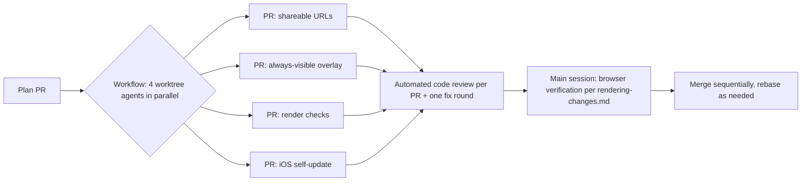

# Plan: Render Integrity Cluster (shareable URLs, always-visible overlay, render checks, iOS self-update)

**Date:** 2026-07-11
**Requested by:** Bryan (post-enriched-tiles retro)
**Execution:** Multi-agent workflow — 4 parallel worktree implementers (Opus for the two complex packages, Sonnet for the two well-scoped ones), each producing its own PR, each followed by an automated code review. Browser verification per `.claude/rules/rendering-changes.md` happens in the main session before merge.

## Problem

1. **Path-dependent rendering (untenable):** bike-route tiles historically aren't loaded when zoomed out (perf). Zooming in then out shows different tiles than starting zoomed out. Same viewport must always paint the same thing, and the bike layer must always be visible — and perform well.
2. **No shareable/deterministic app state:** pan/zoom, active search location, and route state can't be captured in a URL, which blocks easy A/B comparison against baseline and blocks deterministic render tests.
3. **Rendering regressions aren't caught by automation:** flicker (paint vanishing after load), perf regressions, and determinism breaks were all found by Bryan, not CI. `rendering-changes.md` codifies the manual gate; we need the automated version.
4. **iOS Home-Screen (pinned) apps stay on stale versions:** the service worker caches the shell and the standalone app never learns a new version exists. Answer to "can pinned apps self-update?" — yes: standalone iOS web apps run the service worker normally; on each launch/foreground we can call `registration.update()`, detect a waiting worker, and prompt (or auto-apply) `skipWaiting` + reload.

## Measurable outcomes

- [ ] A URL fully encodes map state (center, zoom, mode, search location, route endpoints/waypoints); opening it cold reproduces the exact view and route. Round-trip covered by unit tests.
- [ ] At every zoom level, the bike overlay is visible, and the paint for a given viewport is identical whether reached directly (URL) or via zoom-in-then-out. Verified by an automated determinism check (screenshot compare).
- [ ] Automated render checks exist and run via one command: determinism, time-stability (t0 vs t+15s — paint may be added, never removed), always-visible-layer, and a perf budget. Perf budget also runs in CI as a pure-script benchmark.
- [ ] A pinned iOS app detects a new deploy within one launch/foreground cycle and offers (or applies) an update without re-adding the bookmark. APP_VERSION is visible in the UI and via a `/version` endpoint.

## Alternatives — low-zoom overlay strategy (Package B, the hard one)

| Approach | Risk | Usability | Impact |
|---|---|---|---|
| **B1. Lift the fetch gate; render a simplified subset at low zoom** (filter to long/car-free/bikeway ways, heavier geometry simplification, thinner strokes). Enriched R2 tiles made fetches cheap; measure first. | Medium — paint cost at citywide zoom; must stay off tile-arrival hot path | Same data everywhere, no pipeline change | Fixes determinism directly |
| B2. Bake dedicated low-zoom overview tiles in the pipeline (coarser grid, pre-simplified) | Higher — new pipeline artifact, second data path to keep in sync (classifier-drift class of bug) | Best perf ceiling | Overkill until B1 is measured and fails |
| B3. Keep the gate but make it deterministic (always hide below zoom N regardless of history) | Low | Bike layer invisible at city zoom — fails Bryan's "always visible" requirement | Rejected |

**Recommendation:** B1, with an explicit measurement step first (tile/way counts and paint time for a citywide viewport). Fall back to B2 only if B1 can't meet the perf budget. B3 rejected by requirement.

## Work packages

| Pkg | Model | Scope | Key files |
|---|---|---|---|
| A. Shareable URLs | opus | Extend the existing `URLSearchParams` handling in `App.tsx` to cover all map state; debounced `replaceState`; cold-load restore incl. route recompute | `src/App.tsx`, map engine center/zoom events |
| B. Always-visible deterministic overlay | opus | Find + remove the low-zoom fetch gate; simplified low-zoom rendering; determinism (viewport → paint is a pure function); perf measured before/after | `src/App.tsx` (fetch orchestration), `src/components/BikeMapOverlay.tsx` |
| C. Automated render checks | sonnet | Playwright harness (`scripts/render-checks/`): determinism, time-stability, always-visible, perf budget; `bun scripts/bench-overlay-paint.ts` in CI | `scripts/`, `.github/workflows/` |
| D. iOS PWA self-update | sonnet | `registration.update()` on launch + `visibilitychange`; waiting-worker toast → `skipWaiting` + reload; APP_VERSION in UI; `/version` Worker endpoint | `public/sw.js`, `src/main.tsx`, `src/worker.ts`, small UI |

Dependencies: A enables C's URL-driven determinism check (C builds the harness with a programmatic fallback); B is what makes C's always-visible check pass. All four are separate PRs; merge order A → B → D → C (C last so its checks run green against the merged state).

## Execution & verification

- Each implementer: fresh worktree, `bun install`, implement + unit tests, `bun test`, `vite build`, push branch, open PR.
- None of the packages touch routing-gated files; if an agent finds it must, it stops and reports instead (routing benchmark gate would apply).
- Rendering gate (t0/t+15s stability, falsification pass, before/after perf numbers) is run in the main session with claude-in-chrome before each merge — B especially.
- **Not in the workflow:** NorCal enrichment bake (running locally in the background; upload + manifest cutover + falsification pass handled inline when it completes).

## Risks

- A and B both touch `App.tsx` — expected merge conflicts; resolved at merge time, A first.
- B's perf at citywide zoom is the open question; the measurement step is mandatory before committing to B1, and learnings constraints apply (no per-way fail-soft confetti, no tile-arrival hot-path compute, loading adds paint but never removes it).
- Playwright is a new devDependency (repo currently has none); pinned, dev-only.
