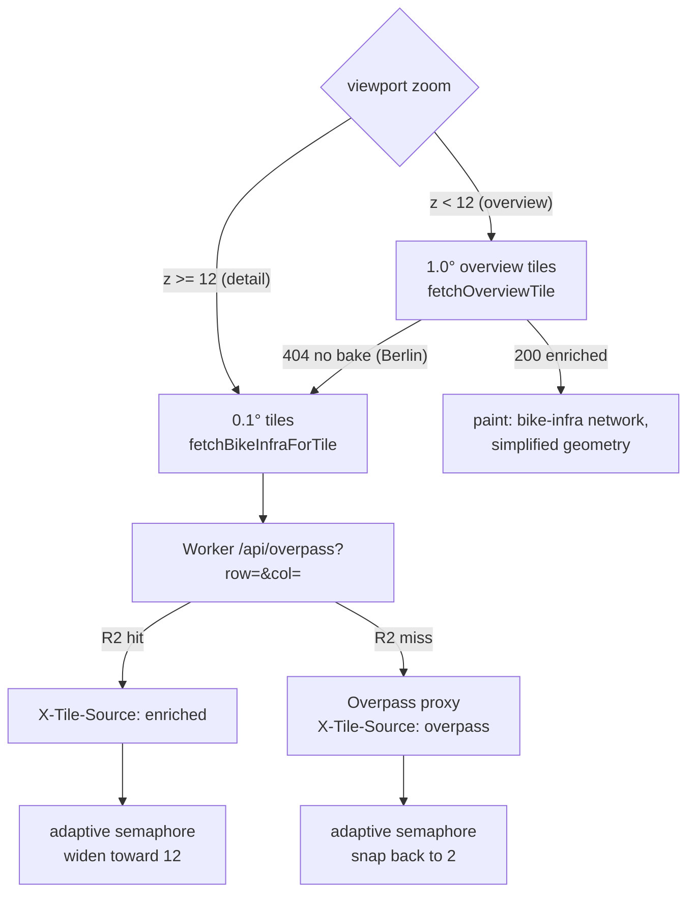

# Overlay zoom scale — adaptive fetch concurrency + baked overview tiles

**Date:** 2026-07-12
**Status:** planned
**Problem owner:** Bryan ("If I'm zoomed out to a good chunk of NorCal, I see lots of small tiles loading. And it takes a while.")

## Problem

The browse overlay has **no zoom pyramid**. Tiles are a single fixed resolution —
0.1° cells (`TILE_DEGREES`, `src/services/overpass.ts`), ~11 km × 9 km at Bay Area
latitude — used identically at z16 and z10. Zooming out therefore asks for *more*
full-detail data, never less:

1. `getVisibleTiles` enumerates every 0.1° cell intersecting the viewport. A NorCal
   view resolves to hundreds–thousands of cells.
2. `selectFetchTiles` (`src/utils/overlayZoom.ts`) caps that at `MAX_FETCH_TILES = 64`
   nearest-to-centre and drops the rest — a deliberate, deterministic coverage gap.
3. Those 64 fetches queue through `MAX_CONCURRENT_FETCHES = 2`
   (`src/services/overpass.ts`) → **32 sequential round-trips**. That queueing delay
   is the bulk of the wall-clock wait.
4. Each tile carries every way at full street-level geometry. `overviewStyle` strips
   the halo, the tap-target layer, and stroke weight — but not one byte of payload.

Net: the zoomed-out view needs the least detail and downloads the most data, over the
slowest queue, and *still* only covers a blob around the cursor.

The 2-wide cap exists for a real reason: **Overpass rate-limits by IP** and 4+ parallel
requests triggered a 429 storm (`docs/process/learnings.md`). But most CA tiles are now
served from our own R2 via the Worker, which has no such limit — and they still queue
behind the same semaphore.

## Measurable outcomes

- [ ] **O1** — A cold NorCal-scale viewport (z10, Bay Area → Sacramento) reaches its
      steady-state paint in **≤ 5 s**, down from the current ~30 s+.
- [ ] **O2** — At z ≤ 11 the overlay covers the **whole viewport**, not the
      64-tile blob around the centre. No deterministic coverage gap at overview zoom.
- [ ] **O3** — Un-baked regions (Berlin) behave **exactly as they do today** at every
      zoom: same tiles, same paint, no Overpass 429 storm. Verified by keeping the
      2-wide cap on any tile served by the Overpass proxy.
- [ ] **O4** — All four render checks (DETERMINISM, TIME-STABILITY, ALWAYS-VISIBLE,
      PERF-BUDGET) pass, extended with overview-zoom scenarios (z9/z10/z11).
- [ ] **O5** — Routing is byte-for-byte unaffected. The router keeps using 0.1° tiles
      via `fetchBikeInfraForTile`; overview tiles are **display-only**.

## Alternatives evaluated

| Approach | Risk | Usability | Impact on O1/O2 |
|---|---|---|---|
| **A. Raise `MAX_CONCURRENT_FETCHES` globally** | **High** — reintroduces the Overpass 429 storm in every un-baked region (Berlin) | No change to coverage; still a 64-tile blob | Partial (O1 only) |
| **B. Adaptive concurrency + baked overview tiles** *(chosen)* | Low — adaptive gate self-throttles the moment a tile comes back from Overpass; overview tiles fail open to today's path on miss | Whole-viewport coverage at overview zoom; fast | Full (O1 + O2) |
| **C. Client-side simplification of the 0.1° tiles** | Medium — still downloads/parses every full-detail byte before simplifying | Fixes paint cost, not fetch cost | Partial (paint only; O1 mostly unaddressed) |

C is rejected because the wall-clock complaint is dominated by **fetch queueing**, not
paint. Simplifying after the download leaves the 32 round-trips intact.

## Design

### WP1 — Adaptive fetch concurrency

Replace the fixed `Semaphore(2)` with an **adaptive gate** that learns from responses:

- Starts at `MIN_CONCURRENCY = 2` (today's safe value).
- Every response carrying `X-Tile-Source: enriched` widens the limit one step toward
  `MAX_CONCURRENCY = 12` (R2 through our own Worker; no IP rate limit).
- Any response **not** from R2 — `X-Tile-Source: overpass`, a missing header, a 429,
  or a 5xx — **snaps the limit back to 2 immediately** and holds it there.

This needs no new endpoint and no coverage probe: the first tile or two in California
pay the 2-wide price, then the gate opens; Berlin never leaves 2-wide. It is
self-correcting at a bake boundary (pan from CA into NV → first Overpass response
snaps it shut).

The gate changes **fetch order and speed only** — never *which* tiles are selected.
The DETERMINISM invariant (`overlayZoom.ts`) is untouched.

### WP2 — Baked overview tiles

A new coarse level baked from the same pipeline, governed by the **same manifest**
(so cutover and `--rollback-to` stay atomic and cover both levels at once).

| Interface | Contract |
|---|---|
| Bake | `scripts/pipeline/bake-overview.ts --tiles <dir> --out <dir>` — reads the baked 0.1° tiles, emits 1.0° cells |
| R2 layout | `<version>/overview/<row>_<col>.json`, row/col = integer degrees |
| Worker | `/api/overview?row=&col=` → R2 object, or **404** (no Overpass fail-open — Overpass cannot serve 1° of data) |
| Client | `src/services/overviewTiles.ts` — `fetchOverviewTile(row, col)`; own cache namespace; **404 → fall back to today's 0.1° path** so un-baked regions are unchanged (O3) |
| Render | `BikeMapOverlay` selects the level by zoom: `z < OVERVIEW_MAX_ZOOM` → overview tiles |

**Contents of an overview tile** — two reductions, both intentional and both stated in
the UI-visible behaviour:

1. **Bike-infrastructure network only.** Ways where `classifyEdge` yields
   `carFree || bikePriority || bikeInfra`. Plain quiet residential is excluded at
   overview zoom. Rationale: at z10 one pixel ≈ 150 m — painting every residential
   street is a solid colour wash that answers no question. The overview answers
   *"where is the good bike network?"*; zooming past z12 reveals full street detail.
   This is a **deliberate difference in painted set between overview and detail zoom**,
   not a bug — the determinism invariant (same viewport+zoom → same paint) still holds.
2. **Simplified geometry.** Douglas–Peucker at ~0.001° (~110 m, well under one z10
   pixel), plus dropping ways shorter than ~200 m post-simplification (sub-pixel).

Ways keep their **full tags and enriched fields** (gradient, `accessGradientPct`,
`componentPaintedLenM`) so the client runs the *same* classifier and the *same*
visibility gates — no parallel classification path
(`.claude/rules/routing-changes.md`, `feedback_no_parallel_classification_paths`).

**Size budget:** ≤ 1.5 MB per overview tile. The bake prints per-tile sizes; if the
budget is exceeded, tighten the simplification tolerance rather than the tag set.

**Fetch budget:** `MAX_OVERVIEW_TILES = 32` — covers a whole-California viewport
(~60 populated 1° cells statewide, ~4–10 in any realistic z9–z11 view).

## Execution

| WP | Scope | Parallel? |
|---|---|---|
| WP1 | Adaptive semaphore in `overpass.ts` + unit tests | yes — isolated to the fetch gate |
| WP2 | `bake-overview.ts`, Worker route, `overviewTiles.ts`, `BikeMapOverlay` level select, render checks | yes — new files; only imports from `overpass.ts` |

WP2 must **not** touch the semaphore code (WP1's surface) and WP1 must not touch the
tile-selection code. Overlap is confined to imports.

Then: bake + upload CA overview tiles under a new manifest version, verify on prod,
keep the previous version as the rollback target.

## Testing & verification

- **Unit** — adaptive gate (widen on enriched, snap on overpass/429/missing header,
  never exceeds MAX, never drops below MIN); overview bake (filter set, simplification
  tolerance, tile assignment); Worker 404-on-miss; client 404 → 0.1° fallback.
- **Rendering gate** (`.claude/rules/rendering-changes.md`, mandatory): t0 vs t+15s
  same-viewport stability at z10 / z12 / z14 / z16; falsification pass ("what looks NEW
  and wrong?"); perf numbers recorded before/after.
- **Render checks** — extend `scripts/render-checks/` with z9/z10/z11 scenarios; the
  ALWAYS-VISIBLE check must now assert **whole-viewport** coverage at overview zoom,
  not just a non-empty floor.
- **Routing benchmark** — not required (no routing surface touched), but assert O5 by
  confirming the router's `fetchBikeInfraForTile` path is unmodified.
- **Berlin regression** — explicit check that an un-baked region still fetches 0.1°
  tiles 2-wide and paints exactly as today.

## Rollback

Overview tiles ship under a new manifest version; `upload-tiles.ts --rollback-to <prev>`
reverts both levels in one manifest write (live within the 60 s Worker TTL). The client
404-fallback means a manifest pointing at a version *without* overview tiles degrades
cleanly to today's behaviour rather than blanking the overlay.
