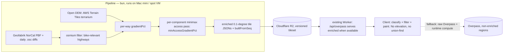

# Enriched Tiles Pipeline — Plan

**Date:** 2026-07-03
**Status:** Approved direction (Bryan, this session): build global-ready infrastructure, iterate on SF Bay Area / NorCal
**Supersedes:** the runtime steep-moat computation (docs/product/plans/steep-moat-filter-plan.md) — the algorithm survives, the *where it runs* changes

## Problem

Browser-side, on-the-fly computation of slope + access-slope has now failed twice
on the same class of issues (#208→#209 revert; #211 re-land still shows poor
performance and paint-then-vanish flicker). The work — per-vertex elevation over
every fetched way, union-find connectivity, per-mode verdicts — is re-done by
every client on every visit, races the paint (flicker: high-slope ways show
briefly then disappear), and competes with interaction on the main thread.
Floating sub-noise-floor fragments still clutter the overview map.

The fix is architectural: **precompute per-way slope and access-slope offline,
serve enriched tiles, reduce the client to filter + paint.**

## Measurable outcomes

1. Browse map at metro zoom does **zero** elevation lookups and **zero**
   union-find in the browser for enriched regions (verified by profiling / code
   path deletion).
2. No paint-then-vanish: ways never render before their verdict is known
   (verdicts ship with geometry).
3. No white-pill confetti and no floating short fragments at overview zooms:
   fragments below the display threshold are suppressed by baked component data.
4. Overlay verdicts on prod match the current production functions' output for
   a sample tile set (parity diag: bake vs runtime classify/gradient on the
   same input, >99% agreement; documented explanation for any divergence).
5. Routing benchmark identical (routing untouched in Phase 1).
6. Pipeline runs for NorCal on the Mac mini; the same code takes a bbox/planet
   flag (global-ready by construction, exercised regionally).
7. Daily updates via Geofabrik NorCal diffs, each enriched tile carrying
   `builtFromSeq` provenance.

## Alternatives considered (session 2026-07-03)

| Option | Verdict |
|---|---|
| **A. Regional precompute → enriched tiles on R2** | **Chosen** — same pipeline scales to planet (A2) by widening bbox |
| A2. Planet-scale bake now | Deferred to Phase 3 — ~$20–100/run spot compute, ~$1/mo R2, single-digit $/mo with daily diffs; infrastructure is built global-ready but iterated regionally where debugging + user feedback live |
| B. On-demand Worker enrichment + cache | Rejected as primary: access-slope needs cross-tile graph context; ends up rebuilding the batch job with worse latency. May return later for cold regions |
| C. Vector tiles (MVT + MapLibre GL) | Horizon item — rendering endgame, not needed to fix current pain |
| R. Server-side routing (port OUR router to a bun server) | Phase 4 option — NOT Valhalla (demoted to benchmark-only 2026-04 for costing-model mismatch; re-encoding rules there recreates parallel-classifier drift). Decide on measured mobile first-route latency after Phase 1 |

## Architecture



### Enriched tile format

Same shape as the current Overpass tile payload (so client changes are minimal),
plus per-way baked fields:

```jsonc
{
  "meta": { "builtFromSeq": 12345, "builtAt": "…", "pipelineVersion": "1", "demSource": "terrarium-v1" },
  "ways": [{
    "osmId": 123, "tags": {…}, "coordinates": […],       // unchanged
    "gradientPct": 4.2,            // gross gradient, same semantics as overlayGradientPct; null only if DEM void
    "accessGradientPct": 7.8,      // minimax: the smallest max-gradient over any path from the mainland seed
    "componentPaintedLenM": 5400   // total painted-candidate length of the way's component (stub/fragment suppression)
  }]
}
```

Key decisions:
- **Tiles are mode-agnostic.** Classification stays in the client
  (`classifyOsmTagsToItem` / `classifyEdge`) — the one-classifier rule survives;
  what gets baked is exactly the expensive part: elevation + graph context.
- **Verdict = arithmetic.** Overlay shows a way iff
  `gradientPct <= ceiling && accessGradientPct <= ceiling(+pushBudget rule) && componentPaintedLenM >= displayFloor(zoom)`.
  Monotone in mode ceiling by construction. No edge fail-soft needed — the bake
  sees the whole region.
- **`accessGradientPct` (minimax / bottleneck shortest path)** replaces the
  binary moat verdict: one number, all modes, computed with a modified Dijkstra
  from the mainland seed (largest component at the 6% baseline, as in
  overlayReachability.ts). Sub-noise-floor stubs get their component's context
  by construction — the confetti class is unrepresentable.
- **Elevation for the bake: open DEM** (AWS Terrain Tiles / terrarium on S3 —
  free open data; decode differs from Mapbox terrain-RGB by a constant formula,
  both decoders kept). The ROUTER keeps runtime Mapbox z=12 in Phase 1 —
  display/routing use different DEMs *temporarily*; Phase 2 unifies them behind
  the benchmark gate. This divergence is explicitly temporary and logged.

### Interfaces

| Interface | Contract |
|---|---|
| `scripts/pipeline/enrich-region.ts` | `bun enrich-region.ts --pbf norcal.pbf --out tiles/ [--bbox …]` → tile JSONs. Uses PRODUCTION gradient semantics (shared helper with elevation.ts) |
| `scripts/pipeline/apply-diff.ts` | daily .osc → dirty way ids → dirty tiles + affected components → re-enrich only those; refuses if base seq mismatch |
| Worker route (existing tile path) | serves R2 enriched tile if present, else proxies Overpass (transparent fallback per tile) |
| Client `fetchBikeInfraForTile` | unchanged signature; enriched fields optional on `OsmWay`. When present → arithmetic gate; when absent → current runtime path (kept until global coverage, then deleted) |
| Upload | `wrangler r2 object put` batch; tileset versioned by prefix, atomic cutover via a manifest object |

## Phases

- **Phase 0 (ships first, standalone PR):** client-only floating-fragment fix —
  hide painted components with total painted length < ~100 m at overview zooms
  (display-only; routing untouched). Interim relief; superseded by
  `componentPaintedLenM` when tiles land.
- **Phase 1 (this plan's build):** pipeline + R2 serving + client consumption
  for NorCal; delete runtime moat path for enriched tiles; parity + perf +
  falsification verification.
- **Phase 2:** unify elevation on the open DEM (router included) — benchmark
  gate; kills the referer-locked local-dev limitation too.
- **Phase 3 (A2):** widen bake to planet on a spot VM; R2 storage ~30–60 GB.
- **Phase 4 (R):** optional bun route-server (same router code) driven by
  measured mobile first-route latency.

## Execution strategy (Phase 1)

Chunks, mostly sequential (format → pipeline → serving → client):
1. Shared gradient helper extraction + terrarium decoder (elevation.ts refactor, routing-neutral, benchmark sanity).
2. Pipeline: PBF ingest (osmium CLI) → grade → minimax access → tile emit + parity diag vs runtime functions on identical input.
3. Diff updater + provenance.
4. R2 upload + Worker serving + manifest cutover.
5. Client consumption + deletion of runtime moat for enriched tiles + fragment floor from baked field.
6. Verification: parity diag, routing benchmark (must be identical), prod falsification pass at multiple zooms (white pills / flicker / doubles / perf), before/after screenshots.

Risks:
- osmium availability on the runner (brew install; document).
- DEM voids / coastline artifacts → `gradientPct: null` stays fail-soft SHOWN, now rare instead of systemic.
- minimax pass memory at planet scale — irrelevant for NorCal, benchmarked before Phase 3.
- R2/Worker serving must not regress non-enriched regions (Berlin keeps working via fallback until its bake).

## Testing & deployment

- Unit: minimax access on synthetic graphs (island/ramp/mainland fixtures reused from overlayReachability tests); tile format round-trip; diff dirty-set computation.
- Parity: bake vs runtime `overlayGradientPct` on the same ways/DEM inputs.
- Benchmark: client-only, both cities, identical (Phase 1 touches no routing files).
- Prod: falsification pass protocol from learnings (what looks NEW and wrong, multiple zooms, click odd artifacts).
- Rollout: enriched tileset behind a manifest switch; rollback = point manifest at previous version (no deploy needed).

## Scope update (2026-07-03, Bryan): pull Phases 2 and 4 into the build

1. **Daily OSM update feeds** — confirmed in scope (Phase 1's diff updater).
2. **Open-DEM swap now, router included** — the bake AND the runtime router
   move to AWS Terrain Tiles (terrarium). This IS a routing change: the full
   routing-changes.md gate applies (benchmark both cities before/after, save
   results doc, commit with the change). Kills the referer-locked Mapbox
   token and the local-dev terrain blackout as side effects. Mapbox decode
   path kept during transition, deleted once benchmark passes.
3. **Server-side routing** — `server/route-server.ts`: a bun HTTP service
   running THE SAME routing code (clientRouter/modes/lts — no parallel
   implementations) over enriched tiles held in memory. Contract:
   `POST /route {start, end, travelMode}` → same shape as clientRoute.
   **Client configurability preserved**: mode/preferences remain client-side
   concepts sent per request; an admin setting `routingBackend: 'client' |
   <url>` selects the backend, DEFAULT 'client' until benchmarks justify a
   flip. Dockerfile included; production deployment target (Fly/Hetzner/CF
   container) is a separate decision AFTER latency data exists.
4. **Phone benchmark** — instrument route timing (graph-build ms + A* ms +
   total) via performance marks surfaced in the audit tab; bench script
   measures server latency for the same OD pairs. Deliverable: comparison doc
   (desktop numbers automated; phone numbers gathered on Bryan's device via
   the instrumented prod build — manual step, documented protocol).

## Test plan (unit + end-to-end)

### Unit (bun test, CI-gated)
- **Pipeline**: PBF ingest on a small fixture extract (checked-in .osm.pbf,
  built once with osmium) → expected way set; terrarium decode against a
  checked-in tile with known elevations; gradient parity — pipeline gradient
  == overlayGradientPct on identical coords+DEM inputs; minimax access on the
  island/ramp/mainland fixtures (reused from overlayReachability tests);
  componentPaintedLenM; tile schema round-trip; deterministic output (two
  runs byte-identical).
- **Diff updater**: synthetic .osc → exact dirty way/tile/component set;
  sequence-mismatch refusal; provenance stamping.
- **Route server**: contract tests over fixture tiles — 200 happy path per
  mode, identical geometry to a direct clientRoute call on the same data
  (same-code invariant, tolerance ZERO), 4xx on malformed input, unknown
  mode, out-of-region points.
- **Client**: enriched-field arithmetic gate (gradient/access/fragment floor,
  monotone across mode ceilings); fallback to runtime path when fields
  absent; routingBackend setting plumbing (client default; server URL used
  when set; graceful fallback to client on server error).

### Parity & integration (scripted, run before merge + in review)
- **Bake-vs-runtime parity diag**: run production classify + gradient on N
  real NorCal tiles vs baked values — >99% way-level agreement, every
  divergence explained (DEM source differences are the expected class).
- **DEM swap ascent comparison**: per-way gradient distribution Mapbox vs
  terrarium over SF + Berlin sample; flag ways shifting across any mode
  ceiling (6/8/10/15%).
- **Server-vs-client route parity**: benchmark OD pairs routed through both
  backends on identical tile data → identical routes required.

### Routing quality gate (same-or-better, per routing-changes.md)
- `bun scripts/benchmark-routing.ts` both cities, before/after the DEM swap
  AND via the server backend. Routes-found must not drop; avg preferred-%
  within ~3pp (improvements welcome); previously-passing pairs must not FAIL.
  Results file committed with the change. Any regression stops the line.

### End-to-end happy paths (scripted where possible + browser falsification pass)
1. Browse SF at metro + street zoom (enriched): overlay renders, no
   paint-then-vanish, no white pills, no fragments at overview, popup opens
   with correct item/LTS.
2. Mode switch: shown set changes monotonically (starting-out ⊆ confident ⊆
   traffic-savvy on the same viewport).
3. Route A→B in SF per mode, client backend — route renders, quality bar and
   ETA populate.
4. Same routes via server backend (admin toggle) — identical geometry.
5. Berlin (non-enriched until its bake): overlay + routing work via the
   Overpass fallback path.
6. Daily-diff cycle on fixtures: edit → diff → re-enrich → tile updates,
   provenance seq advances.
7. Prod falsification pass per learnings (multiple zooms, zoom cycling,
   click odd artifacts, before/after screenshots) — the check that gates
   "done".
