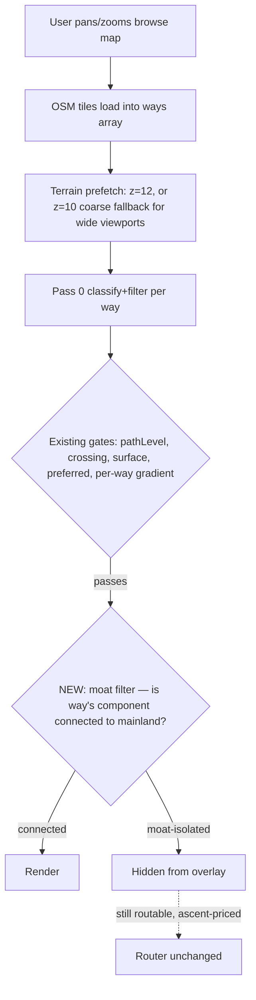
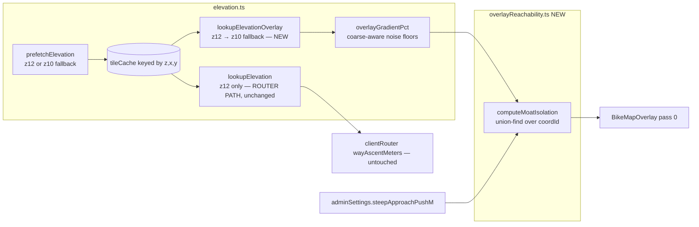

# Steep-Moat Overlay Filter — Plan

**Date:** 2026-07-01
**Status:** Approved by Bryan (design discussion, this session)
**Branch:** `feat/steep-moat-overlay-filter`

## Problem

The browse overlay's steepness gate is **local**: it hides a way whose own gross
gradient exceeds the mode ceiling (`getOverlayMaxGradientPct`, 6–15%). But
family-friendliness is partly a **reachability** property. A flat ridge trail or
hilltop park loop passes the local gate while being unreachable without a
too-steep climb — a "steep moat." Across the hilly Bay Area these moat-isolated
park paths paint as preferred green "Car-free" and visually drown the genuinely
usable flat network (see Bryan's 2026-07-01 Bay-Area-zoom screenshot: Marin
headlands, Peninsula ridges, and Santa Cruz mountains solid with green confetti
for kid-confident).

A second, compounding cause: terrain-RGB prefetch is capped at
`MAX_PREFETCH_TILES = 200` z=12 tiles. A Bay-Area viewport needs ~300+, so much
of the hills has **no elevation loaded at all** → `overlayGradientPct` returns
null → fail-soft shows even individually-steep trails.

## Measurable outcomes

1. Diagnostic script over a Marin Headlands bbox shows **>50% of currently
   painted car-free way length hidden** at kid-confident with the moat filter on
   (strict mode).
2. Diagnostic script over flat-mainland samples (Bay Trail corridor, JFK
   Promenade, the Wiggle) shows **0 named flat greenways hidden**.
3. Client-only routing benchmark (`bun scripts/benchmark-routing.ts
   --no-external`) is **identical before/after** — this is display-only; the
   router's elevation path is untouched.
4. All unit tests + typecheck pass; new modules covered by tests.
5. Browser check at Bay-Area zoom shows visibly decluttered hills vs. the
   screenshot (manual verification; rendering-divergence learning says check
   the painted DOM, not just data).

## Alternatives considered

| Approach | Risk of being visibly wrong | Fixes clutter | Verdict |
|---|---|---|---|
| **A. Connectivity filter** (union-find over gradient-passable graph; hide components not connected to the mainland street grid) | Low — answers real reachability, fail-soft on unknowns | Fully | **Chosen** |
| B. Elevation-prominence heuristic (hide car-free paths >N m above nearby streets) | High — false hides on gently-climbing rail-trails, false shows on low-prominence moats | Mostly | Rejected: erodes overlay trust |
| C. Demote-don't-delete rendering (dim instead of hide) | Low | Partially | Rejected as primary; strict hide chosen by Bryan. Could return later as a treatment option |

Bryan's decisions (2026-07-01): approach A; **strict hard-hide by default**;
**admin option** for a short steep-approach push budget.

## Key workflow

## System design

### Interfaces

| Interface | Signature | Notes |
|---|---|---|
| `computeMoatIsolation` | `(ways: OsmWay[], opts: MoatOptions) => Set<string \| number>` | Returns osmIds of moat-isolated ways. Pure; unit-testable. |
| `MoatOptions` | `{ maxGradientPct: number; pushBudgetM: number; gradientPct: (way) => number \| null; isTileLoaded: (row, col) => boolean }` | `gradientPct` is the caller's cached `overlayGradientPct`; `isTileLoaded` from `BikeMapOverlay.loadedTilesRef`. |
| `lookupElevationOverlay` | `(lat, lng) => number \| null` | Prefers z=12 tile, falls back to z=10. Overlay-only. `lookupElevation` (router default) stays z=12-only. |
| `prefetchElevation` | `(bbox) => Promise<void>` | Existing signature. Internally: if z=12 tile count > `MAX_PREFETCH_TILES`, prefetch z=10 instead. |
| `AdminSettings.steepApproachPushM` | `number`, default `0` | 0 = strict. >0: a steep way ≤ this length still unions (dismount-and-push). Exposed in the admin panel. |

### Algorithm (computeMoatIsolation)

1. For each way with ≥2 coords (control pseudo-ways excluded; **all** highway
   classes participate including LTS-4 — the question is physical access, not
   pleasantness; router bridge-walk philosophy):
   - `g = gradientPct(way)`
   - **passable** iff `g == null` (fail-soft) OR `g <= maxGradientPct` OR
     `wayLengthM <= pushBudgetM`
2. Union consecutive `coordId`s along passable ways only. Impassable ways do
   not union (their nodes may still join via other ways).
3. Per component: total passable way length. **Mainland** = largest component.
4. **Edge fail-soft:** a component with any node in an outermost loaded OSM
   tile (a loaded tile with an unloaded 4-neighbor) is treated as connected —
   its access road may simply not be loaded. Known limitation: networks
   extending past coverage stay shown until coverage grows; converges on
   pan/zoom.
5. Return the isolated set. Overlay hides painted ways in it.

Complexity: union-find over a few thousand ways, milliseconds. Cache in
`BikeMapOverlay` keyed on (ways identity, mode ceiling, pushBudgetM, elevReady).

### Coarse-elevation noise floors

z=10 pixels are ~4× z=12 (~100–120 m at SF). When the z=12 tile covering a
way's midpoint is absent and z=10 supplied the data, `overlayGradientPct`
scales its floors ×4: `MIN_GRADED_LEN_M` 40→160, `OVERLAY_GRADIENT_CUTOFF_M`
2→8. Coarse data must not invent phantom grades on short ways; short ways at
wide zoom simply stay ungated until finer data loads (fail-soft, consistent).

**Router isolation guarantee:** `wayAscentMeters`'s default `elevationFn`
remains the z=12-only `lookupElevation`. The router never reads z=10 data.
This is why the routing benchmark must come back identical.

## Execution strategy

Bryan opted into a multi-agent **Workflow**. Chunking:

| Chunk | Files | Depends on |
|---|---|---|
| 1. Coarse elevation fallback | `src/services/elevation.ts`, `tests/elevation*.test.ts` | — |
| 2. Reachability module | `src/services/overlayReachability.ts` (new), `tests/overlayReachability.test.ts` (new) | — |
| 3. Admin setting + UI | `src/services/adminSettings.ts`, admin panel component | — |
| 4. Overlay integration + diagnostic script | `src/components/BikeMapOverlay.tsx`, `scripts/diag-moat-filter.ts` (new) | 1, 2, 3 |
| 5. Verify: tests, typecheck, benchmark sanity, diag runs, code review | — | 4 |

Chunks 1–3 run in parallel (disjoint files), then 4, then 5. Risks:
- Chunk 1 touches `elevation.ts`, which the router imports — the isolation
  guarantee above is the review focus; benchmark sanity is the gate.
- Chunk 4's edge-fail-soft needs `loadedTilesRef` tile keys; already available
  in `BikeMapOverlay.tsx:399`.

## Testing & deployment

- **Unit:** union-find behaviors — moat island hidden; mainland kept; push
  budget admits short steep ramps; null gradient passable; edge-of-coverage
  component treated connected; monotonicity (higher ceiling ⊆ shown set grows).
  Elevation: z=10 fallback lookup; coarse floors; z=12 preferred when present;
  `lookupElevation` never returns z=10 data.
- **Diagnostic:** `scripts/diag-moat-filter.ts` — fetch real tiles for a Marin
  Headlands bbox and a flat-SF bbox, run production classify + gradient + moat
  functions, print shown/hidden counts and named samples (classify-over-real-OSM
  pattern from learnings).
- **Benchmark:** client-only sanity run; must be identical (display-only change).
- **Browser:** manual check at Bay-Area zoom vs. the screenshot (rendering-
  divergence learning: verify painted DOM, not just data layer).
- **Deployment:** normal PR → CI → prod. Display-only; no migration, no flag.
  Rollback = revert.

## v2 addendum (2026-07-02, after the #208→#209 revert)

The v1 data layer was correct; three rendering/perf integrations failed on
prod (see learnings.md "Overlay rendering"). v2 re-lands with:

1. **Engine race fix** — `GoogleMapsEngine.removePathLayer` tombstones ids
   whose async add hasn't landed, so the pending add is skipped instead of
   leaking an unremovable deck layer (the double-plotting artifact).
2. **Stub verdict inheritance** — pass 0 is now gate-verdict (0a) →
   `inheritStubVerdicts` (0b) → styling (0c). A sub-noise-floor way
   (gradient null) whose entire graded painted adjacency is hidden inherits
   'hidden'; touching any shown way, or having no graded context, keeps the
   old fail-soft (the white-pill-confetti fix).
3. **Off-hot-path moat computation** — `computeMoatIsolation` moved from a
   render-blocking useMemo to an idle-scheduled effect (empty set → shown
   until it lands), and the gradient cache now stores null results keyed by
   the elevReady generation so unknown ways aren't re-graded on every pass.
